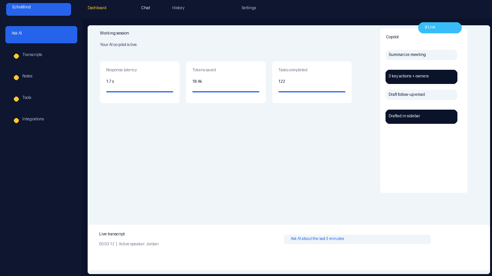
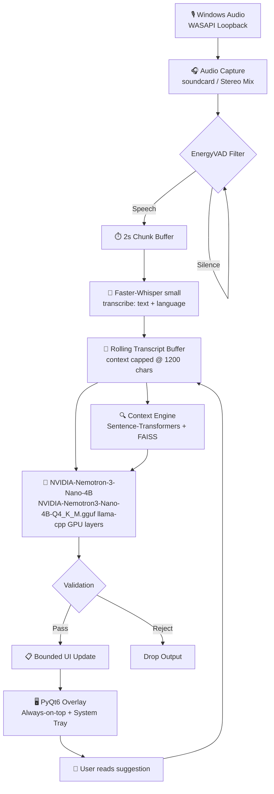

# EchoMind — Real-Time Conversation Intelligence

<p>
Local desktop conversation intelligence for Windows. Captures system audio, transcribes Bangla and English in real time, retrieves relevant context from your documents, and surfaces concise actionable suggestions in a privacy-first always-on-top overlay.
</p>

<!-- BADGES -->


<p align="center">
  <a href="#features">Features</a> ·
  <a href="#screenshots">Screenshots</a> ·
  <a href="#architecture">Architecture</a> ·
  <a href="#quick-start">Quick Start</a> ·
  <a href="#configuration">Configuration</a> ·
  <a href="#usage">Usage</a> ·
  <a href="#performance">Performance</a> ·
  <a href="#project-structure">Structure</a> ·
  <a href="#openai-compatible-providers">OpenAI Providers</a> ·
  <a href="#docker">Docker</a> ·
  <a href="#contributing">Contributing</a> ·
  <a href="#license">License</a>
</p>

---

> **TL;DR for reviewers / investors:** desktop AI meeting assistant, runs 100% offline on Windows, supports Bangla + English, uses whisper + llama + FAISS, and ships as a floating overlay with a system tray — no SaaS, no cloud billing, works behind corporate firewalls.

---

## 👤 Author

Developed by **Sami**.

---

## ✨ Features

- **Live system audio transcription** — WASAPI loopback with `soundcard`, works with meeting apps, browser tabs, and music.
- **Bangla + English + mixed speech** — Faster-Whisper `small` for strong code-switching accuracy.
- **RAG over your documents** — drop `.txt` / `.md` / `.csv` into `backend/docs_ingested/`, FAISS + `all-MiniLM-L6-v2` does the rest.
- **Real-time AI suggestions** — default local inference with NVIDIA Nemotron 3 Nano 4B via `llama-cpp-python`, or OpenAI-compatible provider mode for LM Studio/Ollama/cloud backends when needed.
- **Always-on-top overlay** — draggable PyQt6 window + system tray.
- **Privacy-first** — inference is local. No telemetry, no cloud model calls by default.

---

## 📸 Screenshots / Assets



> Representative app screenshot showing the working session overlay, sidebar navigation, copilot chat, and live transcript bar using project design tokens.

---

## 🏗️ Architecture



**How it works, in plain English:**

1. The app captures system audio using WASAPI loopback.
2. An energy-based VAD filters silence vs speech.
3. 2-second chunks go through `faster-whisper small` for transcription + language detection.
4. The transcript is stored in a rolling buffer.
5. Every chunk, the prompt is enriched with retrieved context from your local docs (FAISS).
6. The LLM generates a single bounded suggestion, either with local `llama-cpp-python` or via an OpenAI-compatible provider if configured.
7. The PyQt6 overlay receives the update, keeping the chat lightweight.

---

## 🚀 Quick Start

```powershell
# 1. Clone
git clone https://github.com/XDR-SAM/EchoMind---Real-Time-Conversation-Intelligence.git
cd real-time-ai-copilot

# 2. Create virtualenv
python -m venv .venv
.\.venv\Scripts\Activate.ps1

# 3. Install dependencies
python -m pip install --upgrade pip
pip install -r requirements_windows.txt

# 4. Download models
python scripts\download_models.py

# 5. Add your context docs (optional)
# Drop files into backend\docs_ingested\

# 6. Run
python scripts\run.py
```

> **Whisper model caching:** `faster-whisper` downloads the `small` model to the OS cache automatically on first run.
> **Model downloads:** see the **Models** section below for exact files and URLs.

---

## 🤖 Models

EchoMind uses two local model categories:

1. **LLM:** `NVIDIA-Nemotron3-Nano-4B-Q4_K_M.gguf` via `llama-cpp-python` **or** any OpenAI-compatible local provider like LM Studio/Ollama
2. **Whisper:** `small` model for speech-to-text via `faster-whisper`

### Auto download

```powershell
python scripts\download_models.py
```

This saves the GGUF file to:

- `backend\\models\\NVIDIA-Nemotron3-Nano-4B-Q4_K_M.gguf`
- HF cache directory under `%USERPROFILE%/.cache/huggingface/hub/`

### Manual download / verify links

- **LLM source:** https://huggingface.co/nvidia/NVIDIA-Nemotron-3-Nano-4B-GGUF
- **LLM file:** https://huggingface.co/nvidia/NVIDIA-Nemotron-3-Nano-4B-GGUF/resolve/main/NVIDIA-Nemotron3-Nano-4B-Q4_K_M.gguf
- **Whisper source:** faster-whisper downloads automatically from the Hugging Face Hub to the OS cache on first run.

### CPU vs CUDA note

- CUDA install: uses `--extra-index-url https://abetlen.github.io/llama-cpp-python/whl/cu121`
- CPU install: use `llama-cpp-python==0.2.90`
- If wheels fail, see the CPU fallback in `docs/installation.md`.

---

## 🌐 OpenAI-Compatible Provider Support

EchoMind's LLM layer supports both local GGUF inference and any OpenAI-compatible HTTP backend.

### Backends

| Backend | Typical base URL | Notes |
|---|---|---|
| **LM Studio** | `http://localhost:1234/v1` | Enable the local server; default port is `1234`. |
| **Ollama** | `http://localhost:11434/v1` | Requires Ollama 0.1.26+ for OpenAI-compatible endpoints. |
| **OpenAI** | `https://api.openai.com/v1` | Works if you accept cloud billing for meeting suggestions. |
| **Custom** | your server `/v1` | Must implement chat completions. |

### Switch backend

Use **one** of these methods:

1. Edit `backend/config.py`
2. Create `.env` in `backend/`

Required keys for an OpenAI-compatible backend:

```ini
LLM_BACKEND=openai_compat
OPENAI_API_BASE=http://localhost:1234/v1
OPENAI_API_KEY=lm-studio
OPENAI_MODEL=nvidia-nemotron-3-nano-4b-instruct
```

> **Windows note:** `OPENAI_API_BASE` should usually end with `/v1`. If your tool exposes CORS/HTTPS locally, use matching scheme/port.

### Example: LM Studio on Windows

1. Open LM Studio → Load `NVIDIA-Nemotron3-Nano-4B-Q4_K_M.gguf`.
2. Start the local server from the LM Studio chat/server panel.
3. Confirm it replies on `http://localhost:1234/v1`.
4. Start EchoMind.

PowerShell quick check:

```powershell
Invoke-Rest -Uri http://localhost:1234/v1/chat/completions -Method Post -ContentType application/json -Body '{"model":"nvidia-nemotron-3-nano-4b-instruct","messages":[{"role":"user","content":"ping"}]}'
```

### Example: Ollama on Windows

1. Install Ollama and pull a visible chat model, for example:

```powershell
ollama pull llama3.1:8b-instruct-q4_K_M
```

2. Start Ollama so the OpenAI-compatible endpoint is enabled.
3. Set config:

```ini
LLM_BACKEND=openai_compat
OPENAI_API_BASE=http://localhost:11434/v1
OPENAI_API_KEY=ollama
OPENAI_MODEL=llama3.1:8b-instruct-q4_K_M
```

4. Verify with PowerShell:

```powershell
Invoke-Rest -Uri http://localhost:11434/v1/chat/completions -Method Post -ContentType application/json -Body '{"model":"llama3.1:8b-instruct-q4_K_M","messages":[{"role":"user","content":"ping"}]}'
```

### Example: OpenAI cloud

```ini
LLM_BACKEND=openai_compat
OPENAI_API_BASE=https://api.openai.com/v1
OPENAI_API_KEY=sk-...
OPENAI_MODEL=gpt-4o-mini
```

Use this only if you are comfortable with cloud inference; the project's default privacy posture is local-first.

### curl alternative

If PowerShell REST behavior causes issues, use curl:

```powershell
curl http://localhost:1234/v1/chat/completions -H "Content-Type: application/json" -d "{ \"model\": \"nvidia-nemotron-3-nano-4b-instruct\", \"messages\": [{\"role\":\"user\",\"content\":\"ping\"}] }"
```

### Troubleshooting

| Symptom | Fix |
|---|---|
| Connection refused | Confirm the provider server is running and `OPENAI_API_BASE` port matches. |
| 401/403 | Check `OPENAI_API_KEY`; LM Studio accepts `lm-studio` by default. |
| Model not found | Set `OPENAI_MODEL` to the exact loaded model identifier, not just the filename. |
| Cloud latency too high | Prefer local/network providers; the app expects fast response times for streaming suggestions. |
| Provider returns HTML/status page | You likely hit a UI route instead of `/v1/chat/completions`; check the base URL. |

### Notes

- `backend/llm_engine.py` sends a single user message and expects standard `chat/completions` output.
- This path is intentionally simple: if your provider works with OpenAI-style chat completions, it should work here.
- On machines where `llama-cpp-python` cannot install, this provider mode is the practical escape hatch for continuing development/testing.

## ⚙️ Configuration

```python
MODEL_NAME: str = "small"              # tiny | small | base | medium.en
CHUNK_SECONDS: float = 2.0             # Lower = lower latency, higher = more reliable
DEVICE_NAME_SUBSTR: str = "speakers"   # Windows WASAPI loopback source
VAD_AGGRESSIVENESS: int = 2            # 0–3
RAG_TOP_K: int = 3                     # docs retrieved per chunk
MAX_TRANSCRIPT_CHARS: int = 1200       # context window fed to the LLM
TRANSCRIBE_DEVICE: str = "cpu"         # "cpu" frees VRAM for LLM on 6GB cards
TRANSCRIBE_COMPUTE_TYPE: str = "int8"  # int8 on CPU, float16 on CUDA
LLM_GPU_LAYERS: int = 35               # RTX 2060 6GB default
RAG_EMBEDDING_MODEL: str = "all-MiniLM-L6-v2"
LLM_CONTEXT_SIZE: int = 2048
OVERLAY_OPACITY: float = 0.92
OVERLAY_WIDTH: int = 520
OVERLAY_HEIGHT: int = 420
```

---

## 🖱️ Usage

### Controls

| Control | Action |
|---|---|
| **Drag overlay body** | Move the floating window |
| **Microphone checkbox** | Switch to mic input for testing |
| **Start / Stop session** | Begin or end a recorded session |
| **Export** | Save the current session to disk |
| **Exit button** | Quit the app |

> If export is not available in your build, the Export action is hidden automatically.

### Tips

- If overlay looks blurry, set Windows display scaling to `100%` and restart the app.
- If the overlay interferes with full-screen apps, avoid pinning it.

---

## 🐛 Troubleshooting

| Symptom | Fix |
|---|---|
| **No audio device found** | Enable `Stereo Mix` in Windows Sound Settings → Recording, then set `DEVICE_NAME_SUBSTR` in `backend/config.py`. |
| **CUDA OOM** | Lower `LLM_GPU_LAYERS` in `config.py`, or run STT on CPU. |
| **Whisper slow transcription on CPU** | Use `MODEL_NAME="tiny"`, or switch to `small.en` if mostly English. |
| **Poor Bangla transcription** | Use at least `MODEL_NAME="small"`. `tiny` struggles with Bangla morphology. |
| **No suggestions generated** | Confirm `models/NVIDIA-Nemotron3-Nano-4B-Q4_K_M.gguf` exists and is fully downloaded. |
| **Overlay blurry** | Set display scaling to `100%`, restart app. |
| **Tray icon missing** | This is a PyQt6 app; some minimal Linux DEs hide tray icons. |

---

## 🎯 Performance

> Reference hardware: **NVIDIA RTX 2060 6 GB**, 16 GB RAM, Windows 10/11.

| Metric | Target |
|---|---|
| Audio-to-text latency | `< 400 ms` |
| End-to-end suggestion latency | `< 1.2 s` |
| Typical e2e latency after speech ends | `~0.8 s` |
| RAM usage | `< 3.5 GB` |
| VRAM usage | `< 4 GB` |

### How to measure

```powershell
python -m backend.pipeline --profile
# or
python backend\main.py --benchmark
```

---

## 🐳 Docker

EchoMind can run in a container for development, tests, and headless benchmarking.

> The containerized path is **Linux-based**, so it does **not** provide the Windows desktop GUI or WASAPI system audio capture. For the full local Windows experience, use the native setup in [Quick Start](#quick-start).

### What the container supports

- dependency validation
- unit tests
- headless benchmark mode
- config parsing checks

### Prerequisites

- Docker
- Docker Compose

### Commands

```bash
# Build image
docker compose build app

# Run benchmark inside container
docker compose run --rm app python backend/main.py --benchmark

# Run tests
docker compose run --rm test

# Interactive shell
docker compose run --rm app bash
```

### Notes

- The container mounts the repo read-write by default.
- Model files are stored in a named volume, `echomind-models`.
- Hugging Face cache is stored in `echomind-hf`.
- If you need GPU acceleration later, convert this to an NVIDIA CUDA base image and enable `runtime: nvidia` in Compose. The current image targets **CPU** inference for portability.

---

## 📁 Project Structure

```
real-time-ai-copilot/
├── assets/
│   └── docs/
│       ├── arch.png
│       └── architecture.mmd
├── backend/
│   ├── __init__.py
│   ├── audio_capture.py      # WASAPI loopback via soundcard
│   ├── config.py             # typed settings + .env
│   ├── context_engine.py     # Sentence-Transformers + FAISS
│   ├── exporter.py           # export sessions to JSON/CSV
│   ├── llm_engine.py         # llama-cpp-python wrapper + guardrails
│   ├── main.py               # application entrypoint
│   ├── pipeline.py           # phased inference pipeline + guardrails
│   ├── session.py            # session lifecycle manager
│   ├── session_store.py      # SQLite-backed session persistence
│   ├── transcriber.py        # faster-whisper wrapper
│   ├── ui.py                 # PyQt6 floating overlay + tray
│   └── vad.py                # lightweight energy-based VAD
├── docs/
│   ├── competitive_research.md
│   ├── gap_analysis.md
│   ├── engineering.md        # latency budget, optimization notes
│   ├── installation.md       # setup prerequisites and first run
│   ├── usage.md              # controls, tray, audio, docs ingestion
│   ├── deployment.md         # configuration, troubleshooting, upgrade paths
│   └── diagrams/
│       ├── architecture.md   # system architecture diagram
│       ├── sequence.md       # runtime sequence diagram
│       └── er.md             # conceptual data-flow diagram
├── scripts/
│   ├── download_models.py    # fetch default GGUF LLM on Windows
│   ├── run.py                # recommended launcher
│   └── verify.py             # import / health checks
├── tests/
│   ├── test_pipeline.py      # pipeline contract tests
│   └── test_startup_simulation.py
├── blueprint.md              # original product blueprint
├── Dockerfile                # container build for headless/test/benchmark use
├── docker-compose.yml        # service definitions for app and CI test runner
├── .dockerignore             # build context exclusions
├── requirements.txt
├── requirements_windows.txt
├── LICENSE
└── README.md
```

---

## 🐳 Docker

EchoMind provides a Linux container for reproducible development and headless validation.

> The container does **not** replace the Windows desktop experience. There is no WASAPI audio capture and no tray/overlay support in Linux containers. Use this for tests, benchmarks, and dependency validation.

### Services

```yaml
app:     interactive container with source mounted and model/cache volumes
test:    runs unit tests
```

### Commands

```bash
# Build image
docker compose build app

# Run a benchmark
docker compose run --rm app python backend/main.py --benchmark

# Run tests
docker compose run --rm test

# Open a shell
docker compose run --rm app bash
```

### Volumes

- `echomind-models` — local model cache
- `echomind-hf` — Hugging Face cache

### Environment defaults

The Compose file sets CPU-safe defaults:

- `TRANSCRIBE_DEVICE=cpu`
- `TRANSCRIBE_COMPUTE_TYPE=int8`
- `LLM_GPU_LAYERS=0`

Override these via `.env` or Compose `environment` mappings as needed.

### Notes

- PyQt6 is installed but no display server is provided; use `--benchmark` or tests only.
- If you later add CUDA container support, switch the base image to an NVIDIA CUDA image and use `runtime: nvidia` or the Docker CUDA runtime.

---

## 📚 Documentation

- [docs/installation.md](docs/installation.md) — end-to-end Windows setup
- [docs/usage.md](docs/usage.md) — controls, tray, audio, docs ingestion
- [docs/deployment.md](docs/deployment.md) — configuration, troubleshooting, upgrade paths
- [docs/engineering.md](docs/engineering.md) — latency budget and optimization notes
- [docs/diagrams](docs/diagrams) — architecture, sequence, and data-flow diagrams
- [blueprint.md](blueprint.md) — original product blueprint

Environment / model preflight checklist:

1. Windows 10/11 64-bit
2. NVIDIA GPU with CUDA-capable driver
3. Python 3.10–3.11
4. `NVIDIA-Nemotron3-Nano-4B-Q4_K_M.gguf` available at `backend\\models\\`
5. `Stereo Mix` enabled if using system audio

---

## 🤝 Contributing

Contributions are welcome — especially around:

- Model swapping (`small.en`, `medium.en`, multilingual Whisper V3)
- VAD improvements (Silero VAD adapter)
- Session export and persistence polish
- FAISS persistence and hot-reload docs
- GPU memory profiling across NVIDIA generations

### Local contribution workflow

```powershell
# 1. Fork / clone
git clone https://github.com/XDR-SAM/EchoMind---Real-Time-Conversation-Intelligence.git
cd real-time-ai-copilot

# 2. Branch
git checkout -b feat/your-change

# 3. Test
python -m unittest discover -s tests

# 4. Commit & push
git commit -m "feat: <your change>"
git push origin feat/your-change

# 5. Open a pull request
```

Please keep tests green. If your change affects the latency budget, update `docs/engineering.md`.

---

## 📄 License

MIT License — see [LICENSE](LICENSE).
