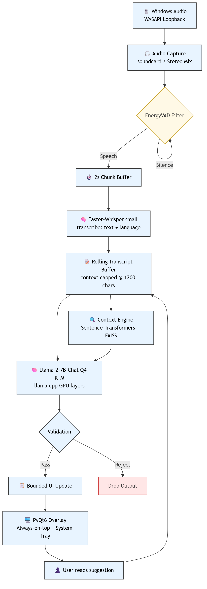
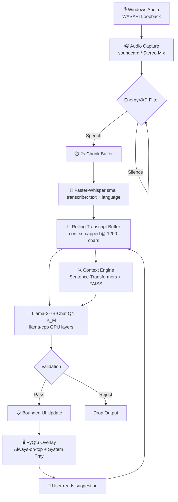

# EchoMind — Real-Time Conversation Intelligence

<p>
Local desktop conversation intelligence for Windows. Captures system audio, transcribes Bangla and English in real time, retrieves relevant context from your documents, and surfaces concise actionable suggestions in a privacy-first always-on-top overlay.
</p>

<!-- BADGES -->


<p align="center">
  <a href="#features">Features</a> ·
  <a href="#screenshots">Screenshots</a> ·
  <a href="#architecture">Architecture</a> ·
  <a href="#quickstart">Quick Start</a> ·
  <a href="#configuration">Configuration</a> ·
  <a href="#usage">Usage</a> ·
  <a href="#performance-targets">Performance</a> ·
  <a href="#project-structure">Structure</a> ·
  <a href="#contributing">Contributing</a> ·
  <a href="#license">License</a>
</p>

---

> **TL;DR for reviewers / investors:** desktop AI meeting assistant, runs 100% offline on Windows, supports Bangla + English, uses whisper + llama + FAISS, and ships as a floating overlay with a system tray — no SaaS, no cloud billing, works behind corporate firewalls.

---

## 👤 Author

Developed by **Sami**.

---
## ✨ Features

- **Live system audio transcription** — WASAPI loopback with `soundcard`, Works with meeting apps, browser tabs, and music.
- **Bangla + English + mixed speech** — Faster-Whisper `small` for strong code-switching accuracy.
- **RAG over your documents** — drop `.txt` / `.md` / `.csv` into `backend/docs_ingested/`, Tada, FAISS + `all-MiniLM-L6-v2` does the rest.
- **Real-time AI suggestions** — Llama 2 7B Chat Q4_K_M via `llama-cpp-python`, GPU offloaded when possible.
- **Always-on-top overlay** — draggable PyQt6 window + system tray.
- **Privacy-first** — inference is local. No telemetry, no cloud model calls by default.

---

## 📸 Screenshots / Assets



Additional assets:

- Architecture source: `assets/docs/architecture.mmd`

> **Maintainer tip:** replace `assets/docs/arch.png` with a real app screenshot when available. The diagram above shows the current overlay layout and pipeline flow.

---

## 🏗️ Architecture



**How it works, in plain English:**

1. The app captures system audio using WASAPI loopback.
2. An energy-based VAD filters silence vs speech.
3. 2-second chunks go through `faster-whisper small` for transcription + language detection.
4. The transcript is stored in a rolling buffer.
5. Every chunk, the prompt is enriched with retrieved context from your local docs (FAISS).
6. Llama 2 7B Chat generates a single bounded suggestion.
7. The PyQt6 overlay receives the update, keeping the chat lightweight.

---

## 🚀 Quick Start

```bash
# 1. Clone
git clone https://github.com/<your-org>/real-time-ai-copilot.git
cd real-time-ai-copilot

# 2. Create virtualenv
python -m venv .venv
.venv\Scripts\activate

# 3. Install dependencies
pip install --upgrade pip
pip install -r requirements_windows.txt

# 4. Download models
python scripts\download_models.py

# 5. Add your context docs (optional)
# Drop files into:
#   backend\docs_ingested\

# 6. Run
python scripts\run.py
```

> **Whisper model caching:** `faster-whisper` downloads the `small` model to the OS cache automatically on first run.

---

## ⚙️ Configuration

All runtime settings live in `backend/config.py` and can be overridden with `.env`.

```python
MODEL_NAME: str = "small"              # tiny | small | base | medium.en
CHUNK_SECONDS: float = 2.0             # Lower = lower latency, higher = more reliable
DEVICE_NAME_SUBSTR: str = "speakers"   # Windows WASAPI loopback source
VAD_AGGRESSIVENESS: int = 2            # 0–3
RAG_TOP_K: int = 3                     # docs retrieved per chunk
MAX_TRANSCRIPT_CHARS: int = 1200       # context window fed to the LLM
TRANSCRIBE_DEVICE: str = "cpu"         # "cpu" frees VRAM for LLM on 6GB cards
TRANSCRIBE_COMPUTE_TYPE: str = "int8"  # int8 on CPU, float16 on CUDA
LLM_GPU_LAYERS: int = 35               # RTX 2060 6GB default
RAG_EMBEDDING_MODEL: str = "all-MiniLM-L6-v2"
LLM_CONTEXT_SIZE: int = 2048
OVERLAY_OPACITY: float = 0.92
OVERLAY_WIDTH: int = 520
OVERLAY_HEIGHT: int = 420
```

---

## 🖱️ Usage

```bash
# Recommended launcher
python scripts\run.py
```

### Controls

| Control | Action |
|---|---|
| **Drag overlay body** | Move the floating window |
| **Microphone checkbox** | Switch to mic input for testing |
| **Exit button** | Quit the app |
| **Tray icon** | Restore / hide overlay |

### Tips

- If overlay looks blurry, set Windows display scaling to `100%` and restart the app.
- If the overlay interferes with full-screen apps, avoid pinning it.

---

## 🐛 Troubleshooting

| Symptom | Fix |
|---|---|
| **No audio device found** | Enable `Stereo Mix` in Windows Sound Settings → Recording, then set `DEVICE_NAME_SUBSTR` in `backend/config.py`. |
| **CUDA OOM** | Lower `LLM_GPU_LAYERS` in `config.py`, or run STT on CPU. |
| **Slow transcription on CPU** | Use `MODEL_NAME="tiny"`, or switch to `small.en` if mostly English. |
| **Poor Bangla transcription** | Use at least `MODEL_NAME="small"`. `tiny` struggles with Bangla morphology. |
| **No suggestions generated** | Confirm `models/llama-2-7b-chat.Q4_K_M.gguf` exists and is fully downloaded. |
| **Overlay blurry** | Set display scaling to `100%`, restart app. |
| **Tray icon missing** | This is a PyQt6 app; some minimal Linux DEs hide tray icons. |

---

## 🎯 Performance Targets

> Reference hardware: **NVIDIA RTX 2060 6 GB**, 16 GB RAM, Windows 10/11.

| Metric | Target |
|---|---|
| Audio-to-text latency | `< 400 ms` |
| End-to-end suggestion latency | `< 1.2 s` |
| Typical e2e latency after speech ends | `~0.8 s` |
| RAM usage | `< 3.5 GB` |
| VRAM usage | `< 4 GB` |

### How to measure

```bash
python -m backend.pipeline --profile
```

---

## 📁 Project Structure

```
real-time-ai-copilot/
├── assets/
│   └── docs/
│       ├── arch.png
│       └── architecture.mmd
├── backend/
│   ├── __init__.py
│   ├── audio_capture.py      # WASAPI loopback via soundcard
│   ├── config.py             # typed settings (Pydantic) + .env
│   ├── context_engine.py     # Sentence-Transformers + FAISS
│   ├── llm_engine.py         # llama-cpp-python wrapper + validation
│   ├── main.py               # application entrypoint
│   ├── pipeline.py           # phased inference pipeline + guardrails
│   ├── transcriber.py        # faster-whisper wrapper
│   ├── ui.py                 # PyQt6 floating overlay + tray
│   └── vad.py                # lightweight energy-based VAD
├── docs/
│   ├── engineering.md        # latency budget, optimization notes
│   ├── installation.md       # setup prerequisites and first run
│   ├── usage.md              # controls, tray, audio, docs ingestion
│   ├── deployment.md         # configuration, troubleshooting, upgrade paths
│   └── diagrams/
│       ├── architecture.md   # system architecture diagram
│       ├── sequence.md       # runtime sequence diagram
│       └── er.md             # conceptual data-flow diagram
├── scripts/
│   ├── download_models.py    # fetch Llama-2 GGUF on Windows
│   ├── run.py                # recommended launcher
│   └── verify.py             # import / health checks
├── tests/
│   ├── test_pipeline.py      # pipeline contract tests
│   ├── test_startup_simulation.py
│   └── test_static.py
├── blueprint.md              # original product blueprint
├── requirements.txt
├── requirements_windows.txt
└── README.md
```

---

## 📚 Documentation

- [docs/installation.md](docs/installation.md) — end-to-end Windows setup
- [docs/usage.md](docs/usage.md) — controls, tray, audio, docs ingestion
- [docs/deployment.md](docs/deployment.md) — configuration, troubleshooting, upgrade paths
- [docs/engineering.md](docs/engineering.md) — latency budget and optimization notes
- [docs/diagrams](docs/diagrams) — architecture, sequence, and data-flow diagrams
- [blueprint.md](blueprint.md) — original product blueprint

Environment / model preflight checklist:

1. Windows 10/11 64-bit
2. NVIDIA GPU with CUDA-capable driver
3. Python 3.10–3.11
4. `llama-2-7b-chat.Q4_K_M.gguf` downloaded
5. `Stereo Mix` enabled if using system audio

---

## 🤝 Contributing

Contributions are welcome — especially around:

- Model swapping (`small.en`, `medium.en`, multilingual Whisper V3)
- VAD improvements (Silero VAD adapter)
- FAISS persistence and hot-reload docs
- GPU memory profiling across NVIDIA generations

### Local contribution workflow

```bash
# 1. Fork / clone
git clone https://github.com/<your-username>/real-time-ai-copilot.git
cd real-time-ai-copilot

# 2. Branch
git checkout -b feat/your-change

# 3. Test
pytest

# 4. Commit & push
git commit -m "feat: <your change>"
git push origin feat/your-change

# 5. Open a pull request
```

Please keep tests green. If your change affects the latency budget, update `docs/engineering.md`.

---

## 📄 License

Private / Commercial — modify freely for production use.
